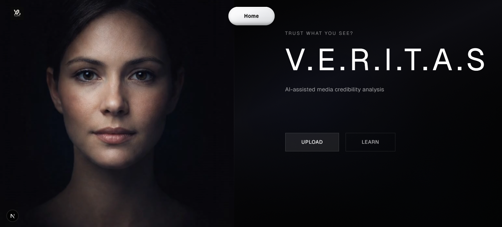
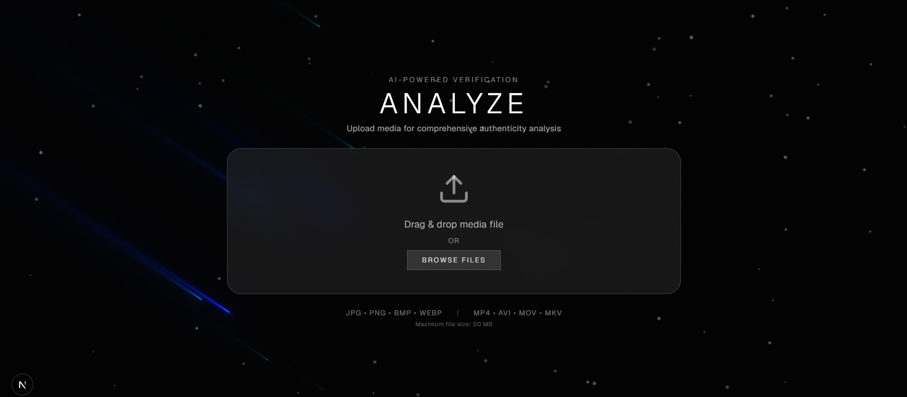
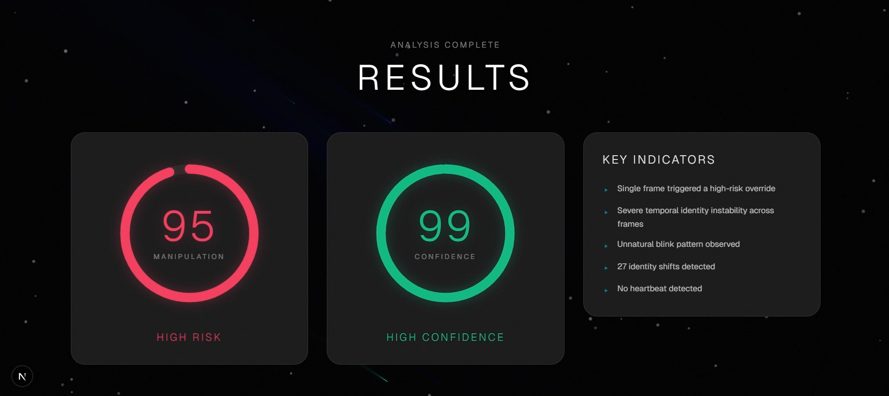
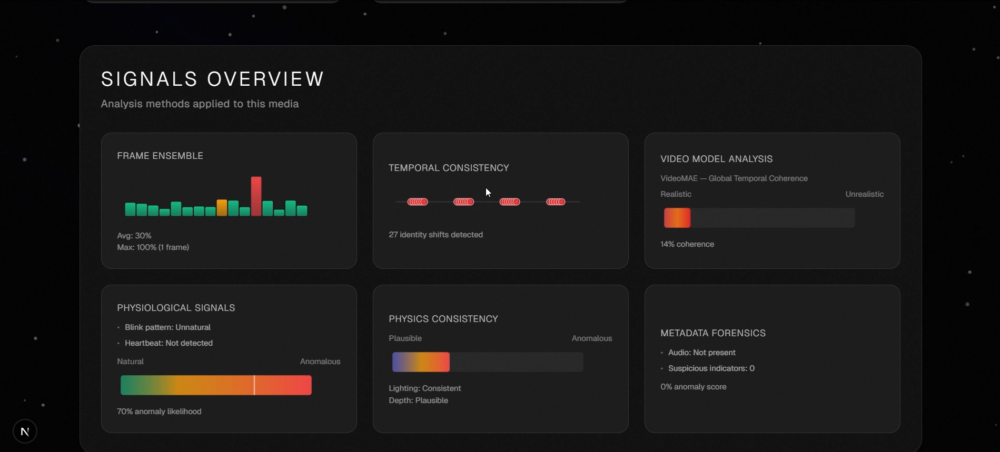

<div align="center">
  
  
  # V.E.R.I.T.A.S
  
  ### Verifiable Evidence & Risk Inference Through AI Systems
  
  AI-powered deepfake detection for images and videos.
  
  ---
  
  🌐 **[Live Frontend Demo](https://genai-media-verifier.vercel.app/)**
  
  ⚠️ **Note:** Backend is not connected on the live demo. Please run locally for full functionality.
  
  ---
  
</div>

## 📺 See It In Action

**Image Analysis:**

https://github.com/user-attachments/assets/veritas_image_test.mp4

**Video Analysis:**

https://github.com/user-attachments/assets/veritas_demo.mp4

---

## 📸 Screenshots

**Landing Page:**



**Upload Interface:**



**Risk Assessment:**



**Analysis Dashboard:**



---

## What is this?

V.E.R.I.T.A.S (Verifiable Evidence & Risk Inference Through AI Systems) analyzes media files to detect potential deepfakes and manipulation. Upload an image or video, and get a detailed analysis of authenticity markers.

## Features

- Image and video deepfake detection
- Multiple detection methods (facial analysis, lighting, motion tracking, etc.)
- Real-time analysis with progress tracking
- Educational resources explaining how detection works
- Clean, modern UI
- Quick analysis mode for faster results (videos)
- Comprehensive analysis mode for detailed reports

## Tech Stack

**Frontend**
- Next.js 16 with React 19
- TypeScript
- Tailwind CSS
- D3.js for data visualization
- Three.js for 3D effects
- Framer Motion for animations

**Backend**
- FastAPI (Python)
- PyTorch + HuggingFace Transformers
- OpenCV and MediaPipe for video/image processing

## Getting Started

### Prerequisites

- Node.js 18+
- Python 3.10+

### Installation

**Frontend:**
```bash
cd frontend
npm install
npm run dev
```

**Backend:**
```bash
cd backend
python -m venv venv
source venv/bin/activate  # On Windows: venv\Scripts\activate
pip install -r requirements.txt
uvicorn main:app --reload
```

Frontend runs on `http://localhost:3000`  
Backend runs on `http://localhost:8000`

## Project Structure

```
├── frontend/          # Next.js app
│   ├── app/          # Pages (landing, learn, upload)
│   ├── components/   # React components
│   └── public/       # Static assets
├── backend/
│   ├── main.py       # FastAPI server
│   ├── services/     # Detection logic
│   └── models/       # AI model definitions
```

## How It Works

The system uses multiple detection methods:

**For Images:**
1. **Neural Networks** - Multiple model ensemble for deepfake detection
2. **Frequency Domain Analysis** - DCT/FFT anomaly detection
3. **Facial Forensics** - Landmark and texture analysis
4. **Metadata Inspection** - EXIF data validation

**For Videos:**
1. **Frame-based Analysis** - Per-frame deepfake detection
2. **Temporal Consistency** - Identity shift detection across frames
3. **Video Model Analysis** - Global coherence checking (VideoMAE)
4. **Physiological Signals** - Blink patterns and heartbeat detection
5. **Physics Consistency** - Lighting and depth validation
6. **Audio Analysis** - Audio presence and sync validation
7. **Metadata Forensics** - Suspicious indicators

Each method contributes to an overall confidence score and risk level.

## API

**Analyze Image:**
```bash
POST /analyze/image
Content-Type: multipart/form-data
Body: { file: <image_file> }
```

**Analyze Video:**
```bash
POST /analyze/video
Content-Type: multipart/form-data
Body: { 
  file: <video_file>,
  mode: "quick" | "deep"  # optional, defaults to "deep"
}
```

Full API docs available at `http://localhost:8000/docs` when running the backend.

## Environment Variables

**Frontend** (`.env.local`):
```
NEXT_PUBLIC_API_URL=http://localhost:8000
```

**Backend** (`.env`):
```
MODEL_CACHE_DIR=./models_cache
UPLOAD_DIR=./uploads
TEMP_DIR=./temp
MAX_FILE_SIZE=52428800
```

## Supported Formats

**Images:** JPG, PNG, BMP, WEBP  
**Videos:** MP4, AVI, MOV, MKV  
**Max file size:** 50MB

## Notes

- First run downloads AI models automatically (can take a few minutes)
- Video analysis takes longer than images
- Quick mode skips some analysis layers for faster results
- The `models_cache/` and `uploads/` directories are gitignored
- Results are probabilistic and should be combined with human judgment

## Limitations

This tool provides probabilistic assessments, not definitive proof. Results should be used alongside:
- Contextual analysis
- Source verification
- Chain of custody validation
- Expert human judgment

## Contributing

PRs welcome. Please test locally before submitting.
